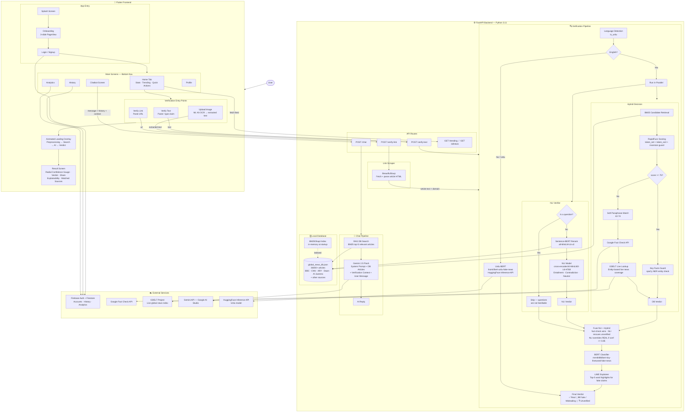

# NewsTrustAI — System Architecture

---

## Verdict Decision Logic

| Condition | Verdict |
|---|---|
| DB score ≥ 75 + entity facts match | **Real** (78–95% confidence) |
| DB score ≥ 75 but entity facts mismatch | **Edited Claim Suspected** |
| Soft paraphrase match (42–74) | **Real** (lower confidence) |
| Google Fact Check says false | **Fake** (95% confidence) |
| NLI contradiction confidence ≥ 0.85 | **Fake / Misleading** |
| GDELT finds main source coverage | **Real** |
| Nothing found anywhere | **Unverified** |

---

## Tech Stack

| Layer | Technology |
|---|---|
| Mobile App | Flutter 3 (Dart) |
| Backend API | FastAPI + Uvicorn (Python 3.11) |
| Auth & Storage | Firebase Auth + Cloud Firestore |
| Article Database | JSON flat-file, 36 000+ articles |
| Candidate Retrieval | BM25Okapi (rank-bm25) |
| Fuzzy Scoring | RapidFuzz |
| Semantic Embeddings | sentence-transformers/all-MiniLM-L6-v2 |
| NLI Model | cross-encoder/nli-MiniLM2-L6-H768 |
| BERT Classifier | mrm8488/bert-tiny-finetuned-fake-news-detection |
| Explainability | LIME |
| Urdu Model | ikomil/bert-urdu-fake-news (HuggingFace) |
| Live News Index | GDELT Project API |
| Fact Check | Google Fact Check Tools API |
| AI Chatbot | Gemini 2.5 Flash (Google AI Studio) |
| Link Scraping | requests + BeautifulSoup4 |
| OCR (on-device) | Google ML Kit Text Recognition |
